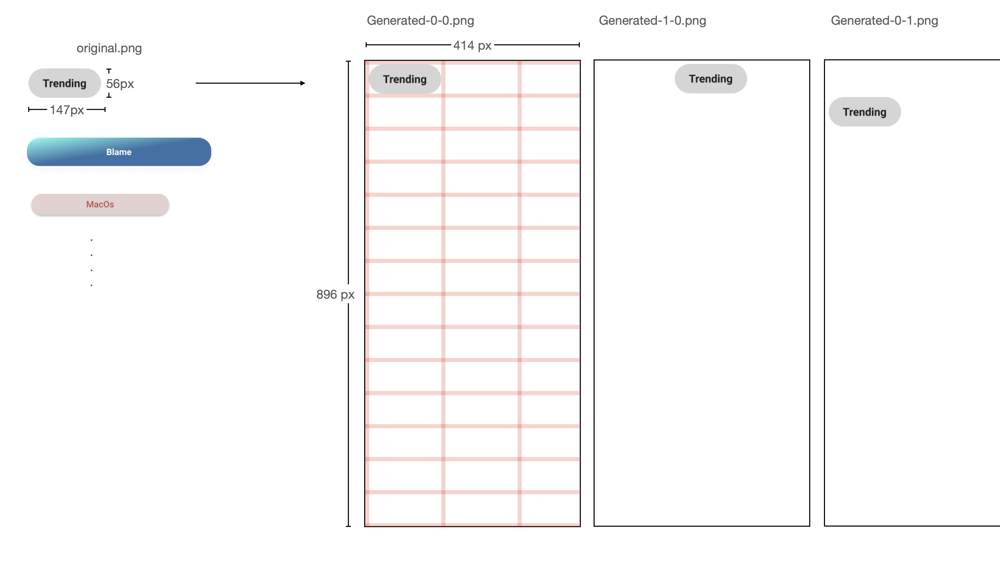

# UI Data labeling helper

It changes the UI component images extracted from Sketch or Figma into a data set for machine learning, and creates annotation xml files too.

## Concept




## Quick start

```bash
yarn i
node resizer.js
```


## Usage

You can change imageFolder, xmlFolder, outputFolder in the resizer.js file.

```javascript
...
//  ./resizer.js
// Able to change Folder paths to fit for your images
const imageFolder = "./images/sample/test/";
const outputFolder = "./images/sample/testing/";
const xmlFolder = "./images/sample/xml/";

const createxml = (to_file_name, dimensions, x, y, xi, yi) => {
...
```

